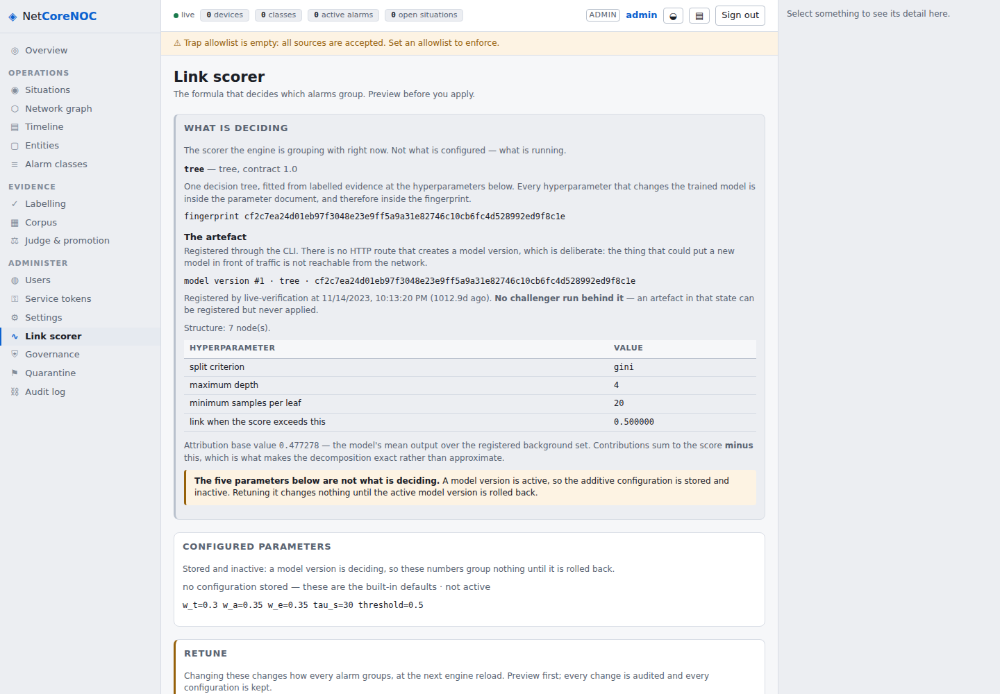
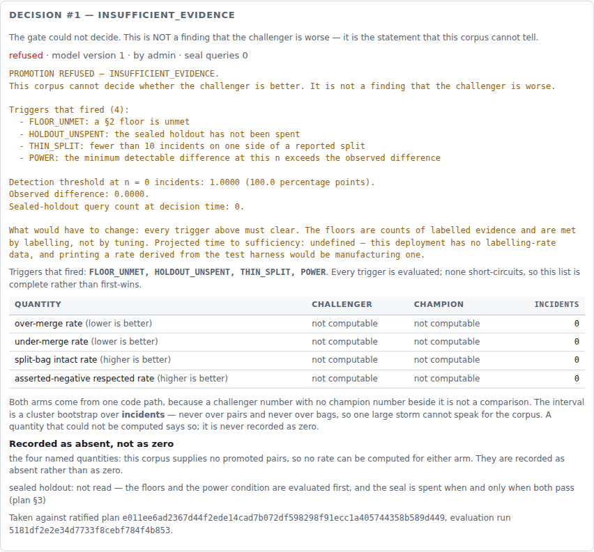

# v0.14.0 — live verification: the model family in a real browser

Every screen assertion in [`v0.14.0-phase-5.md`](v0.14.0-phase-5.md) is measured through the DOM
harness. The harness links the real module graph, mounts the real components and dumps the real tree
— and it has **no layout, no cascade and no paint**. It cannot tell you that two words are touching.

**Five things were wrong on screen while every structural assertion was green**, and four of them
are exactly that: two words touching.

> **The tool is scratch, not a dependency.** Playwright is installed with `pip install --target`
> into a directory outside the repository and the Chromium is the container's own.
> `pyproject.toml` is unchanged, `import playwright` fails inside the project's virtualenv, nothing
> in `tests/` imports it, and `make qa` neither runs nor requires it. **Five runtime dependencies.**
> The same posture v0.13.0's pass took, and the same reason: a browser drive that had become a
> fourth CI dependency would have bought a smaller thing than it cost.

---

## 1. Method

A real appliance, not a fixture server.

```sh
NETCORENOC_DB=…/live.db  NETCORENOC_TRAP_PORT=11162 \
NETCORENOC_HTTP_PORT=8099  NETCORENOC_HTTP_HOST=127.0.0.1 \
python -m netcorenoc.main
```

The database is created empty; a **`tree` is fitted by `tree.fit_document`, registered with
`insert_model_version` and activated with `set_active_model_version`** — the three steps a promotion
takes — and the appliance is then booted on it, generating and printing its own bootstrap banner.

**The gate is not bypassed so much as not consulted.** This database exists to render the screen an
operator sees *after* a promotion, and no corpus this project holds reaches one
([`v0.14.0-phase-7.md`](v0.14.0-phase-7.md) leads with why). Everything the drive then does — signing
in, changing the forced password, reading `/api/scorer`, **proposing a promotion** — goes over TCP to
the real routes.

Chromium headless at 1440 × 1000, with console messages and every HTTP response ≥ 400 collected for
the whole session.

## 2. What was driven — 39 checks, all green

| | Result |
|---|---|
| the sign-in card renders on a first-run appliance | **pass** |
| a first-run admin is asked to change the password **before anything else** | **pass** |
| signing in reaches the authenticated console | **pass** |
| the scorer screen leads with **"WHAT IS DECIDING"** | **pass** |
| it names the kind that is running, and the artefact behind it | **pass** — `tree`, model version #1 |
| it warns that the five weights are **not** what is deciding | **pass** |
| the tunable table is still on the screen, labelled | **pass** |
| the old **"Active configuration"** heading is gone | **pass** |
| the hyperparameters are rendered from `params_document` | **pass** — criterion, depth, leaf size, threshold |
| the attribution base value is shown **with its meaning** | **pass** |
| the promotion screen renders, seal query count **0** | **pass** |
| the candidate selector is offered | **pass** |
| an artefact with no challenger run is marked as such | **pass** |
| the propose control states its consequence before it can be used | **pass** |
| **a promotion proposed live, through the real route** | **pass** — `INSUFFICIENT_EVIDENCE` |
| the refusal names every trigger that fired | **pass** — 4 of them |
| the decision detail shows **all four** named quantities, **both arms** | **pass** |
| all 15 other views reached by address, each rendering a body, none throwing | **pass** |
| no console error the app itself raised | **pass** |
| no unexpected HTTP response ≥ 400 | **pass** |

### 2.1 The 401 that is not a defect

`GET /api/me` returns **401** before sign-in, and the browser logs a resource-load message for it.
The first version of this drive counted both as failures. They are the authentication working: that
401 is how the console learns there is no session. The check was rewritten to assert the **opposite**
— that the only 4xx in the whole session are the pre-sign-in ones — which is a stronger statement
than "none", and is the one that would catch a 401 appearing somewhere it should not.

### 2.2 The two screens this release added, as they render



*"What is deciding" leads; the artefact, its fingerprint and its hyperparameters follow; the five
additive weights are below, labelled and marked inactive. Before this release that screen showed the
five weights alone, under the heading "Active configuration" (F60).*



*The refusal in full, then the four named quantities for both arms with their intervals — "not
computable" where a quantity is absent, never `0.0000`. This decision was proposed live through
`POST /api/promotion` during the pass.*

Both are unedited captures from the drive described above, committed beside this document so a
reader of the repository can check the claims in §2 without running anything.

## 3. Five things the harness could not see

### 3.1 `Attribution base value0.477278`

```diff
-      ? html`<p class="hint">Attribution base value
-          <code class="mono">${score(document.base_value, 6)}</code> — the model's mean output over
+      ? html`<p class="hint">${"Attribution base value "}
+          <code class="mono">${score(document.base_value, 6)}</code>${" "}
+          — the model's mean output over
```

`htm` collapses the newline between a text node and the element that follows it. Every
`word\n<code>` pair in this release's two new modules rendered as `wordVALUE`. **The DOM tree was
correct** — a text node, then an element — so no structural assertion could have caught it, and the
harness has no layout to reveal it.

Four instances, all fixed: the base value, `by admin`, `Triggers that fired:FLOOR_UNMET`, and
`ratified plane011ee…` / `evaluation run5181df…`.

### 3.2 A `<td>` inside a `<p>`

`widgets.TimeCell` renders a `<td>`. `model.js` used it inside a `<p>`, which is invalid HTML: the
browser lays the cell out as a block, so the sentence broke across three lines and the full stop
after it landed **alone on its own line**:

```
Registered by live-verification at
11/14/2023, 10:13:20 PM
1012.9d ago
. No challenger run behind it — …
```

Replaced with the `absolute` / `relative` / `timeTitle` helpers `TimeCell` itself uses. The harness
builds a DOM without a layout engine and without HTML content-model validation, so a `<td>` in a
`<p>` is simply a node in a tree there.

### 3.3 The refusal reason overflowed its panel

The gate's reason is several paragraphs with a bulleted trigger list. `verdict.js` renders it in a
`<pre>` so that structure survives — and a bare `<pre>` does not wrap, so *"…the floors are counts of
labelled evidence and are met by"* ran off the right edge of the panel with the rest of the sentence
unreachable.

`pre.refusal-reason { white-space: pre-wrap; overflow-wrap: anywhere; overflow-x: auto; }`. **A
cascade defect, in the one layer this project's instrument does not have.**

### 3.4 The decisions table collapsed the same reason into a wall

Before the expanded detail existed, the reason lived in a **table cell**, where every newline in it
collapses into a single space. Twenty-five lines of prose in one cell, unreadable at any width.

The cell now carries the reason's **first line** and the expanded decision below carries the whole
text. Two renderings of one string, each in the place it is legible.

### 3.5 `configuration #— — not active`

Two em dashes in a row: one from `config.config_id ?? "—"` and one from the *"not active"* suffix.
Now `no configuration stored — these are the built-in defaults · not active`, which is also a truer
sentence: with a model version running there is no configuration row at all, and *"#—"* was pointing
at that absence with punctuation.

## 4. What this pass did not do

* **No corpus.** The database holds one artefact and no alarms, so the Situations, Graph, Timeline
  and Entities screens were driven **empty**. They render their empty states and throw nothing; how
  they look with a real incident on them is v0.13.0's live pass, not this one.
* **No second role.** Driven as `admin` only. The role matrix is the DOM harness's subject and it is
  green there; what a viewer's *layout* looks like is unmeasured, as it was in v0.13.0.
* **No graph render.** d3 executes in a real browser here, unlike in the harness, but nothing was
  asserted about what it drew beyond the screen not throwing. It stays this project's largest
  uncovered surface.
* **One viewport.** 1440 × 1000. Narrow layouts are unmeasured.
* **`BETTER` was never rendered live.** The applied branch of `verdict.js` is exercised by a DOM test
  against a fixture row, not by a browser against a real decision, because the gate has never
  returned it.

## 5. Verdict

**39 checks, 39 green, after five fixes.** Every one of the five was invisible to an instrument that
asserts structure, and every one was obvious within seconds of a browser painting the page — which is
ADR #182's whole argument, stated again with this release's own evidence:

> A UI release gets one pass with eyes on it, and that pass is not automated.

v0.14.0 is not a UI release, and it needed the pass anyway. The lesson generalises: **a release that
adds a screen inherits the rule, whatever else it is about.**
